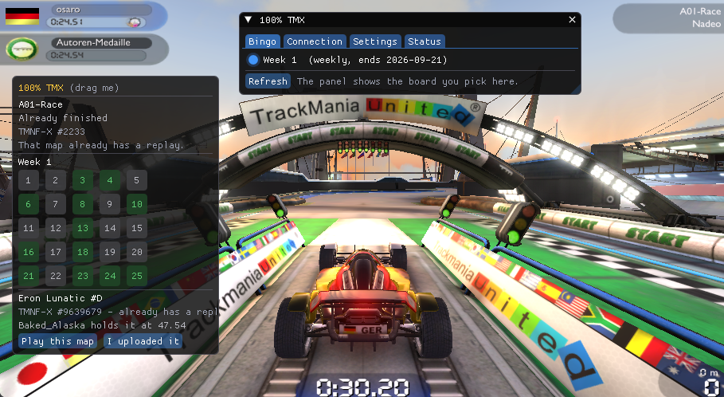
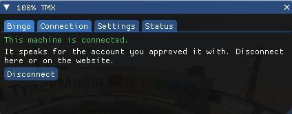
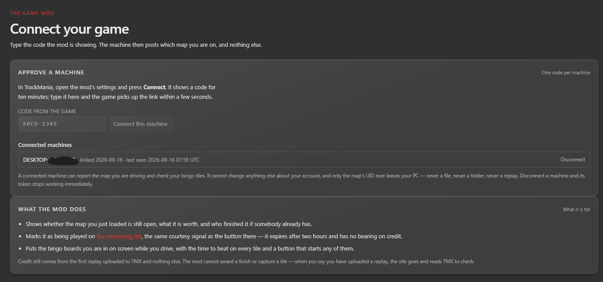
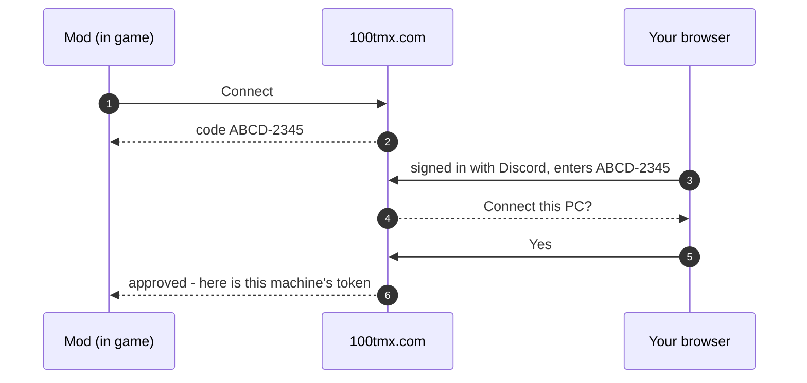
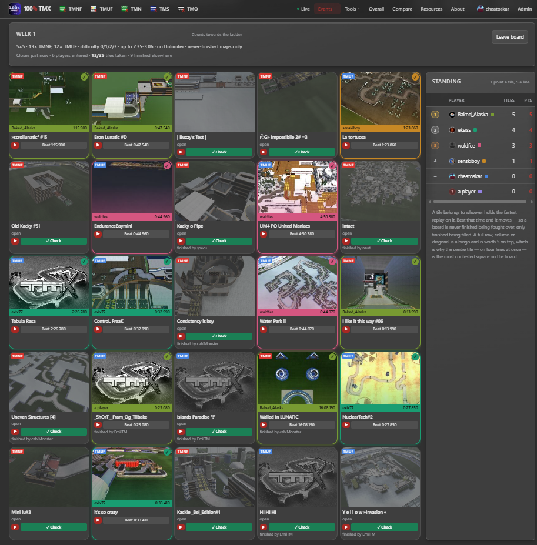
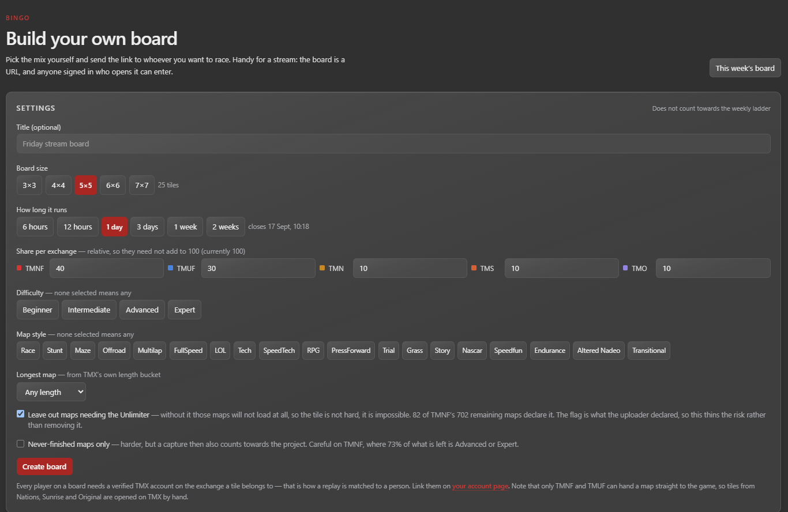
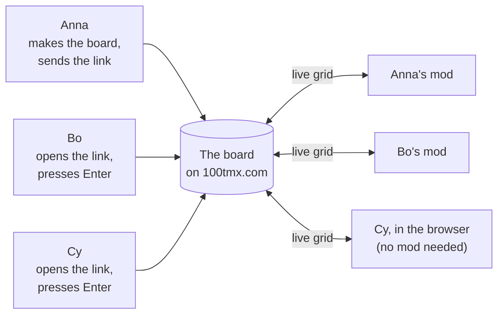
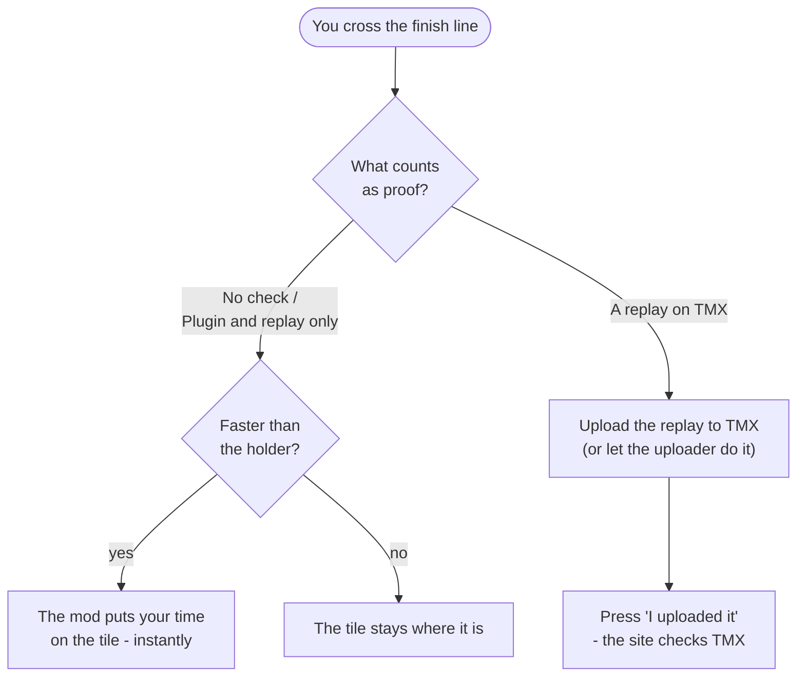
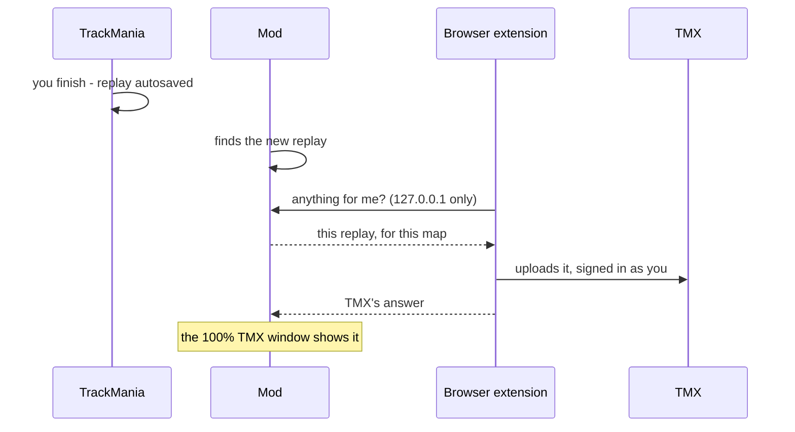

# 100% TMX + Bingo — an overlay for TrackMania Forever

Bingo boards and the [100% TMX](https://100tmx.com) project, **inside the game**,
for TrackMania **Nations Forever** and **United Forever**.

- **Race your friends on a bingo board** without alt-tabbing: the grid, who holds
  each tile, the time to beat, and a button that loads any of its maps.
- **Know what a map is worth** the moment it loads: has anybody ever finished it,
  and what does the 100% TMX project score it at?

You do not have to be part of the 100% project to use it - make a board, send
the link to three friends, and race them for the evening.



**[Download](../../releases/latest)** · **[100tmx.com](https://100tmx.com)** ·
**[Bingo boards](https://100tmx.com/events/bingo)**

---

### ✨ Highlights
- 🎯 **Live Bingo board with automatic checks** — Times and claims update live in game the moment you cross the finish line.
- 👥 **Play custom Bingo boards with friends** — Create your own board, send the link, and battle for tiles in real time.
- 📍 **Mark your current map on the site while playing** — Shows your current map on 100tmx.com so others know it is being hunted.
- 🔔 **Get notified when your map is beaten while playing** — Instant in-game alerts whenever someone beats your time or claims a map.
- 📊 **See map ELO in-game** — Instantly check if a map has ever been finished and what it scores.
- 🚀 **Automatically upload replays to TMX** — Seamlessly sends autosaved records to TMX via the companion browser extension.

---

## Contents

1. [Quick start](#quick-start)
2. [Installing](#installing)
3. [Connecting your account](#connecting-your-account)
4. [Playing bingo with friends](#playing-bingo-with-friends)
5. [The 100% TMX window](#the-100-tmx-window)
6. [Uploading replays automatically](#uploading-replays-automatically)
7. [In the game: windows, keys, settings](#in-the-game-windows-keys-settings)
8. [What leaves your machine](#what-leaves-your-machine)
9. [Troubleshooting](#troubleshooting)
10. [For developers](#for-developers)

---

## Quick start

1. Install the [TrackMania ModLoader](https://tomashu.dev/software/tmloader/).
2. Download **`100TMX.zip`** from [Releases](../../releases/latest), unzip it,
   and run **`100TMX-Installer.exe`** from the unzipped folder.
3. Open the ModLoader, tick **100% TMX + Bingo**, start the game.
4. In game press **F9 → Connection → Connect**, and approve the code on the
   website that opens.
5. Join a board at [100tmx.com/events/bingo](https://100tmx.com/events/bingo),
   pick it on the **Bingo** tab, and drive.

---

## Installing

The mod is loaded by the [TrackMania ModLoader](https://tomashu.dev/software/tmloader/),
so install that first.

Everything is in **`100TMX.zip`** on the [Releases](../../releases/latest) page:

```
100TMX.zip
├── 100TMX-Installer.exe     copies the folder below into the ModLoader
├── README.txt               these steps, in English and German
└── 100% TMX + Bingo\        the mod, ready for the ModLoader
```

### With the installer

1. Unzip **`100TMX.zip`** - the whole thing (right-click it, *Extract All...*).
2. Run **`100TMX-Installer.exe`** from the unzipped folder.
3. Open the ModLoader, tick **100% TMX + Bingo**, start the game.

To update, do the same with the new zip. To remove the mod, run
`100TMX-Installer.exe /uninstall` (`/quiet` installs without the dialog).

### By hand, without the installer

1. Unzip **`100TMX.zip`**.
2. Open `%LOCALAPPDATA%\TMLoader\database\TmForever\products` (paste it into
   the Explorer address bar).
3. Copy the **`100% TMX + Bingo`** folder from the zip in there. If it already
   exists, let Windows merge the folders - the new version goes next to the old
   one.
4. Open the ModLoader, tick **100% TMX + Bingo**, start the game.

To remove the mod, delete the `100% TMX + Bingo` folder again.

> **A virus warning?** The installer is not code-signed, so Windows may still
> distrust it. It does nothing but copy the `100% TMX + Bingo` folder that sits
> next to it - since 1.0.0 it no longer carries the mod inside itself, which is
> what Defender used to flag as `Wacatac!ml`. If you would rather not run it,
> copy the folder by hand as above. Every release lists the **SHA-256** of each
> file; check yours with `Get-FileHash .\100TMX.zip -Algorithm SHA256`.

<details>
<summary>What is in the folder, if you want to make it yourself</summary>

The ModLoader keeps a product database instead of a mods folder. The folder
name is exactly what it lists, and each version has a folder of its own:

```
products\
  100% TMX + Bingo\
    description.yaml
    1.0.0\
      description.yaml
      100TMX.dll
```

`100% TMX + Bingo\description.yaml`:

```yaml
name: 100% TMX + Bingo
author: cheatoskar
type: modification
homepage: 'https://100tmx.com/'
description: 'Bingo boards and the 100% TMX project in the game.'
```

`1.0.0\description.yaml` - the ModLoader's CoreMod is what actually loads the
DLL, so it is listed as a dependency:

```yaml
executable: 100TMX.dll
dependencies:
  - id: CoreMod
    version: ^1.0.1
changelog: '- The bingo panel, map status, and map marks.'
```

Save both as plain UTF-8 (Notepad's default). The folder in the zip is built by
the PowerShell script [`install-modloader.ps1`](install-modloader.ps1), which
can also install straight from a DLL:

```powershell
powershell -ExecutionPolicy Bypass -File install-modloader.ps1 -Dll .\100TMX.dll -Version 1.0.0
```

Nothing else is touched - no registry, no game folder, no startup entry. The
installer's source is [`installer/main.cpp`](installer/main.cpp).
</details>

<details>
<summary>Without the ModLoader (ASI loader)</summary>

1. Take `100TMX.asi` from [Releases](../../releases/latest) and the 32-bit
   [Ultimate ASI Loader](https://github.com/ThirteenAG/Ultimate-ASI-Loader)
   named `binkw32.dll`.
2. In your TrackMania folder, rename the existing `binkw32.dll` to
   `binkw32Hooked.dll` and put the loader's `binkw32.dll` in its place.
3. Put `100TMX.asi` next to `TmForever.exe` and start the game normally.
</details>

---

## Connecting your account

There is no browser inside TrackMania, so the mod does not sign in itself: it
shows a short code, and you approve it on the website where you are already
signed in.



1. In game press **F9**, open **Connection**, press **Connect**.
2. A code like `ABCD-2345` appears and your browser opens
   [100tmx.com/link](https://100tmx.com/link).
3. Sign in with Discord, type the code, confirm the machine.
4. Within a few seconds the mod says it is connected.





Every TrackMania Exchange account you have linked on the website comes with it -
there is nothing else to set up in the game. You can disconnect from the mod, or
from [100tmx.com/link](https://100tmx.com/link), at any time; the machine's
token stops working at once.

---

## Playing bingo with friends

A board is a grid of real TrackMania maps from the exchanges. Drive a map to
take its tile; somebody faster takes it back off you. Complete rows, columns and
diagonals are worth extra.

### Setting up an evening

1. **One person makes the board** at
   [100tmx.com/events/bingo/new](https://100tmx.com/events/bingo/new): which
   exchanges, how hard, how long it runs, teams or not, and
   [what counts as proof](#what-counts-as-proof). Then they send the link.
2. **Everybody opens the link, signs in with Discord and presses Enter.** That
   is what puts you on the standing. Or join the
   [weekly board](https://100tmx.com/events/bingo), which is open to everyone.
3. **In game, pick the board** on the **Bingo** tab (F9). The Bingo window now
   shows it while you drive.
4. **Drive.** Click a tile and press **Play this map** - the running game
   downloads the map and starts it.

| The board on the website | Making your own |
|---|---|
|  |  |



- The mod is optional for your friends: the board works from a browser too.
- The mod is per machine, not per board: connect it once and it shows whichever
  board you pick.
- The board's maker can run it from the board page: rename, extend or end it,
  clear a tile or remove a player.

### What counts as proof

Whoever makes the board chooses how a tile is taken. The mod handles each one
differently:

| On the website | How you take a tile | With the mod |
|---|---|---|
| **A replay driven for this board** | Upload a replay to TMX, driven after the board started | Press **I uploaded it** - the site checks TMX |
| **Any replay on TMX** | The same, but a replay of any age counts - for maps you have all driven before | Press **I uploaded it** |
| **No check (works with the plugin)** | The time is self-reported - nothing is uploaded | **Automatic** when you finish, or **Enter my time...** for a run driven elsewhere |
| **Plugin and replay only** | The time must come from the game, or a replay file on the website | **Automatic** when you finish. No typed times. |

The first two need your TrackMania Exchange account
[linked on the website](https://100tmx.com/guide/accounts) - the site has to
know which replays are yours. The last two do not.



### When a tile is filled in

On a self-reported board (*No check* or *Plugin and replay only*) your time goes
on the tile **the moment you cross the line** - first run or tenth, record or
not - as long as it beats the current holder. The mod reads the game's own
"race finished" state, so pressing Escape at a checkpoint is never mistaken for
a finish. Turn it off under **Settings → Put my finish straight onto
self-reported boards** if you would rather press a button.

A capture shows on the website straight away and in everybody else's mod within
about twenty seconds.

> A board is its own competition, but the 100% TMX project still sees the
> exchange: if you put the first-ever replay on a map nobody has finished, it
> counts as a project finish, like any replay would.

---

## The 100% TMX window

For the [100% TMX project](https://100tmx.com) - finishing every map on the
TrackMania Exchange sites. The window shows, for the map you are on:

- **Still open or already finished** - and if finished, by whom.
- **What it is worth** to the project (its ELO).
- **Excluded maps**, before you spend a run on one.
- **If somebody finishes it while you are driving**, you hear about it.
- **Your replay's upload** after a finish - see below.

With **Share what I am playing** on, the map shows as *being played* on the
website's remaining list, so two people do not spend an evening on the same map
by accident. It disappears when you leave the map or close the game.

---

## Uploading replays automatically

Every replay TrackMania autosaves goes up to TMX by itself - on **any** map
that is on an exchange, not only the ones the 100% project still needs.

TMX has no upload API - only a browser that is signed in to TMX can upload a
replay for you. So the mod does not upload anything itself and **never sees
your TMX login**: it hands the replay TrackMania just saved to the
[TMX Universal Track Downloader](https://github.com/cheatoskar/TMX-Downloader)
browser extension, which uploads it with your existing session.

### Setting it up

1. Install the
   [TMX Universal Track Downloader](https://github.com/cheatoskar/TMX-Downloader)
   extension.
2. In game: **F9 → Connection → Upload my replays through the browser**.
3. In the extension's toolbar popup, switch the bridge on.
4. The mod asks **"A browser wants to connect"** - press **Allow**. Done; it is
   remembered.

Also make sure **autosaving replays is on** in TrackMania's settings - without
it there is no file to hand over.



Good to know:

- **TrackMania only autosaves a run that beats your own best** on the map, so
  that is what gets uploaded - which is also exactly what TMX accepts. A slower
  run leaves no file and nothing happens.
- Maps that are not on any exchange (your own, or from a server) are skipped -
  there is nowhere to upload them.
- On a map the project still needs, or a bingo tile checked against TMX, the mod
  tells you if no replay turned up; everywhere else a run without a new record
  passes quietly.
- The mod looks in `Documents\TrackMania` and `Documents\TmForever`. If your
  replays are elsewhere, set the folder on the Connection tab.
- The connection is local only (`127.0.0.1`), needs the key the mod handed over
  when you pressed Allow, and does not exist while the switch is off.

---

## In the game: windows, keys, settings

**F9** opens and closes the settings window.

The mod shows two windows, each moved and resized on its own:

| Window | Shows |
|---|---|
| **100% TMX** | the map you are on: open or finished, its worth, messages, replay uploads |
| **Bingo** | the tile you are on and the time to beat, the grid, the standing - whenever a board is picked or the map you are on is a tile. Drag it wide enough and the tiles become the maps' screenshots. |

While you are **driving**, the windows let clicks through to the game. Standing
on the line, paused, on the results screen or back from alt-tab, you can click
and drag them normally. **F9** always makes them clickable.

| Settings tab | For |
|---|---|
| **Bingo** | pick the board to show |
| **Connection** | connect or disconnect this PC, and the replay uploader |
| **Settings** | automatic tiles, sharing what you play, window size and opacity, when the windows take the mouse |
| **Status** | game build, mod version, what the mod reads right now - include it in bug reports |

Everything is stored in `Documents\100TMX\config.ini`. Deleting it forgets the
machine completely.

---

## What leaves your machine

- **Nothing until you connect.**
- After that: the **ID of the map you are on** (a short code that identifies an
  upload on the exchange, nothing of the file itself), and the board actions
  you take. Nothing while you are in the menus. Sharing what you play is
  announced when you connect and can be switched off in Settings.
- On self-reported boards, **your finish time** for the tile you drove.
- With the replay uploader on: the replay goes from your PC, through the
  browser extension, to TMX - never to this project's server.

The mod **only reads** the game; it never changes TrackMania or its files.
Credit in the 100% project still comes only from replays on TMX - the mod can
never award a finish.

---

## Troubleshooting

**The installer is flagged as a virus.** See the note under
[Installing](#by-hand-without-the-installer) - copy the folder by hand instead,
and compare the SHA-256 with the release.

**"This TrackMania build is not recognised."** TrackMania Forever exists in
several builds and the mod only reads a build it can verify. Note the build id
on the **Status** tab and open an issue with it, the game (Nations/United) and
how you start it (ModLoader, ASI, Steam).

<details>
<summary>Describing a build yourself (advanced)</summary>

`config.ini` takes an `[offsets]` section, checked like the built-in ones before
it is trusted:

```ini
[offsets]
name = my-build
app = 0x972EB8
get_id_name = 0x5357D0
challenge = 0x198
race = 0x454
challenge_uid = 0xDC
challenge_name = 0x108
race_player_info = 0x330
player_info_player = 0x238
player_sub = 0x1C
player_state = 0x314
player_time = 0x2B0
```
</details>

**My time did not go on the tile.** Check that the board is *No check* or
*Plugin and replay only* (the others need a replay on TMX), that your time beats
the holder's, and that **Settings → Put my finish straight onto self-reported
boards** is on.

**The windows will not take the mouse.** They let clicks through while you are
driving; stop the car or pause. **F9** always makes them clickable.

**Something else.** `Documents\100TMX\log.txt` records what the mod did - attach
it to an issue.

---

## For developers

Visual Studio 2022 (or the Build Tools) with the C++ workload, plus CMake.
**32-bit only** - TrackMania Forever is a 32-bit game.

```bash
cmake -S . -B build -A Win32
cmake --build build --config Release
```

This builds `build/Release/100TMX.dll` (the same bytes as `100TMX.asi`) and
`100TMX-Installer.exe`, which copies the folder next to it. Dear ImGui is fetched and pinned at
configure time, and the runtime is linked statically. CI builds every push; a
`v*` tag publishes a release - `100TMX.zip`, the DLL, the ASI and SHA-256
hashes - with [`RELEASE_NOTES.md`](RELEASE_NOTES.md) at the top of its notes.

| File | Does |
|---|---|
| `dllmain.cpp` | starts the mod's threads and gets out of the loader's way |
| `hook.cpp` | hooks Direct3D 9 `EndScene`/`Reset` to draw the overlay |
| `overlay.cpp` | the two windows and the settings window |
| `game.cpp` | reads the game's state - map, race clock, finish, speed - read-only, every pointer guarded |
| `worker.cpp` | everything that talks to the website, on its own thread |
| `bridge.cpp` | the local connection for the browser extension |
| `config.cpp`, `log.cpp` | the ini and the log, written in the background |
| `http.cpp`, `json.h` | WinHTTP, and just enough JSON |

How the finish is detected, and what was tried before, is written up in
[`docs/finish-marker.md`](docs/finish-marker.md).

---

## Credits and licence

- [Dear ImGui](https://github.com/ocornut/imgui) - MIT.
- [Twinkie](https://github.com/flownyy/Twinkie) (MIT, Ahmad Saleh) - the
  published reference for where TmForever keeps the current map.
- [TMInterface](https://github.com/donadigo/TMInterfaceClientPython) - the
  layout of the player state the finish and speed are read from.

No code from Twinkie or TMInterface is compiled in, and neither is needed at
runtime.

The mod is **MIT licensed** - see [LICENSE](LICENSE). Fork it, build it, and
especially: add offsets for a TrackMania build it does not know yet.
