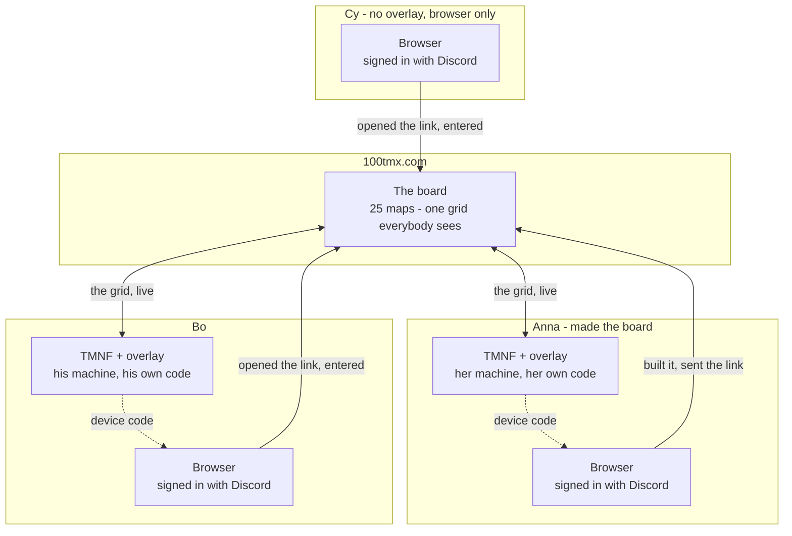
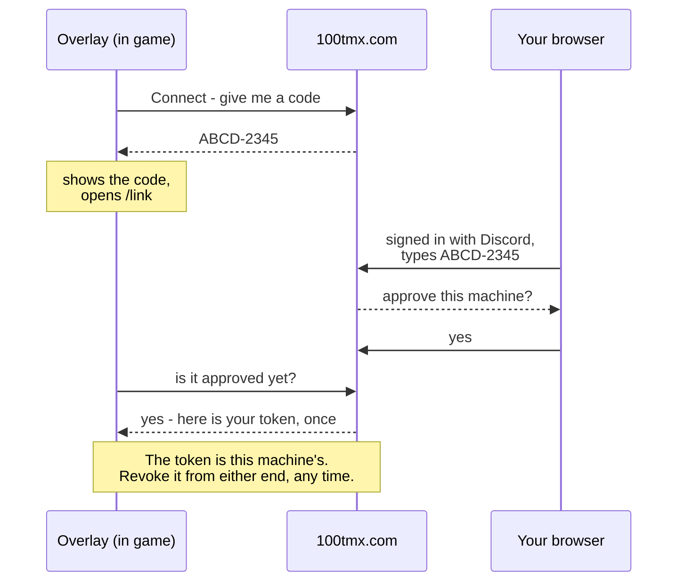
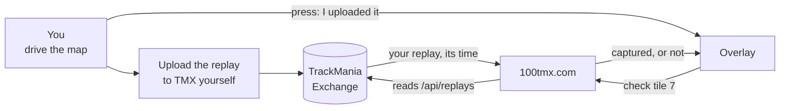
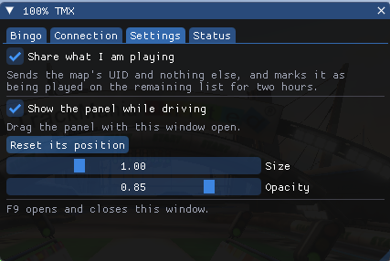

# 100% TMX + Bingo Overlay for TMNF/TMUF

**Bingo, in the game.** An overlay for **TrackMania Nations Forever** and
**TrackMania United Forever** that puts the boards you are playing on screen
while you drive: your tiles, who holds the others, the time you have to beat -
and a button that loads any of their maps without leaving the game.

**You do not have to be part of any project to use it.** Make a board, send the
link to three friends, and race them for the evening - the bingo half stands on
its own.

If you *are* chasing the [100% TMX project](https://100tmx.com), it also answers
the question every map raises the moment it loads: has anybody ever finished
this one, and what is it worth?


> **Status: early.** v0.5.1 runs, and has been through real sessions on
> Nations Forever. If the panel says a build is not recognised, see
> [Unrecognised build](#unrecognised-build) - that is a five-minute fix and a
> useful bug report.

---

## Features

**Bingo**

- **Every board you are in**, weekly and private, in a picker. Choose one and
  the panel keeps it on screen while you drive.
- **The grid, colour-coded** — yours, somebody else's, still open — with the
  tile you are standing on outlined.
- **The time to beat** on every tile, and who holds it. No alt-tabbing to check
  whether that run was good enough.
- **Teams**, when the board is played in sides: one colour for your whole team,
  the standing scored per side, and a tile your own team already holds says so —
  beating a teammate moves the tile and wins the side nothing.
- **Play this map**: hands the running game a TMX ManiaCode, which downloads the
  map and starts it. Pick a tile, drive it, next.
- **"I uploaded it"**: after you put the replay on TMX, one button asks the site
  to check the tile. The site reads TMX and believes only that.
- **On a self-reported board**, where the site checks nothing, the overlay puts
  the run you just finished straight onto the tile. On by default, one switch in
  Settings to make it a button instead. Only there; see below.

The boards themselves live on the website — drawn weekly, or built privately
for an evening — and the panel is a window onto the same board everybody else
is playing.

| The board on the site | Building your own |
|---|---|
|  |  |

**The 100% project, if you are in it**

- **Is this map still open?** Green means nobody has ever put a replay on it and
  it is worth finishing — with the ELO the project scores it at. Grey means it
  is done, and names who got it.
- **Your mark on the remaining list.** The map you are on shows as *being
  played* on the website, so two people do not spend an evening on the same map
  by accident - with how far through the lap you are. It goes the moment you
  leave the map or close the game, and expires by itself within minutes if the
  game dies without saying so. A courtesy signal, never a reservation.
- **Excluded maps are called out** before you waste a run on one.

**Everything else**

- **Settings in-game** (F9): connect or disconnect, the sharing switch, and how
  the panel behaves. The panel itself is dragged and resized directly - big
  enough and the tiles become the maps' own screenshots.
- **Nothing is sent until you say so.** Connecting a machine is one deliberate
  act; sharing what you play is a separate question, asked once, right after.
- **Nothing is written to the game.** The mod only reads, and it never patches,
  injects into, or modifies TrackMania itself.

### What it deliberately does not do

**It cannot award you a finish.** Credit in the project comes from the first
replay uploaded to TMX and nothing else — that is the rule the whole archive is
rebuilt from. The mod reports what you are playing and shows what the site
knows; it is never evidence. Same for bingo: a tile is captured by a replay on
TMX, checked server-side, or not at all.

---

## Play bingo with your friends

A board is twenty-five TrackMania maps drawn at random from the exchanges. You
take a tile by putting a replay on the map; somebody faster takes it back off
you. Full rows, columns and diagonals are worth extra. It is played in Nations
or United Forever, and needs nothing from the 100% project.

### First time here

Three things before a board means anything, and each exists for a reason:

1. **Sign in at [100tmx.com](https://100tmx.com) with Discord.** One click, and
   the only thing asked of Discord is your name and avatar. A board has to know
   who took which tile, so this is what lets you enter one at all.
2. **Link your TrackMania Exchange account** - the one-minute guide is at
   [100tmx.com/guide/accounts](https://100tmx.com/guide/accounts). A tile is
   captured by a replay *on the exchange*, so the site has to know which account
   there is yours before it can check one. Without this you can watch a board
   but not take anything on it.
3. **The mod is optional.** Everything works in a browser; the overlay only
   saves the alt-tabbing. If you do want it, install it as above and connect it
   at [100tmx.com/link](https://100tmx.com/link).

### How a session fits together

One board on the website, and everybody around it. The board is the shared
thing; the overlay is one per person, linked to their own machine.



Three things that trip people up, and all three are in that picture:

- **The board is made once, by one person.** Everybody else opens the link and
  presses *Enter the board*. Nobody needs to build their own.
- **Everybody signs in with Discord on the website.** That is what makes a tile
  yours rather than somebody's. It is not optional, and the overlay cannot do
  it for you.
- **The overlay is per machine, not per board.** Cy above is playing the same
  board from a browser with no mod at all. It only saves the alt-tabbing.

### What links a machine to your account

There is no browser inside TrackMania, so the overlay cannot sign in. It asks
for a short code instead and you approve it on the website, already signed in —
which means the machine inherits every TMX account you have already proved,
with nothing new to link.



### Who talks to TrackMania Exchange

Nobody but the site. The overlay never uploads anything and never reads the
exchange — which is why a tile cannot be faked by editing a file on your PC.



The one exception is a board set to **no check** on the website. That kind
checks nothing against the exchange at all and says so on its own face, so
there the overlay may put the run you just finished straight onto the tile.
Everywhere else a replay on TMX is the only thing that takes one.

### Playing

1. **Get a board.** Enter [this week's](https://100tmx.com/events/bingo), which
   is open to anyone, or [build your own](https://100tmx.com/events/bingo/new):
   choose how many maps come from each exchange and how hard they should be,
   give it a length - an evening, a weekend, a fortnight - and send the link.
   Anybody signed in who opens it can enter.
2. **Enter it.** One button, and it is what puts you on the standing.
3. **Drive a tile.** Each one is a real map: open it, take it from the exchange,
   drive it. With the mod, *Play this map* loads it straight into the game.
4. **Upload the replay to TMX**, then press *I uploaded it*. The site reads the
   exchange and checks - that is the only thing that captures a tile, from the
   game or the browser.

   Unless the board says otherwise. TMX refuses a replay slower than your own
   record, so on maps you have already beaten you cannot upload a new one at
   all - which used to mean a bingo on those maps could never be captured.
   Whoever builds the board now picks what counts: a replay driven for the
   board, **any** replay on TMX whatever its age (the one for maps you have all
   played - your existing time takes the tile, and beating somebody still means
   going faster, which TMX does accept), or **no check at all**. On that last
   kind the overlay can submit the run you just drove, because such a board is
   self-reported by design and says so on its face. On the other two it cannot,
   for the same reason it may never write to the archive: a program on your PC
   is not evidence.
5. **Watch it move.** A capture reaches the website immediately and everybody
   else's overlay within about twenty seconds.

There is a *How it works* button on both board pages that says the same thing,
if somebody would rather read it there.

Worth knowing: a private board never feeds the weekly ladder, but it cannot opt
out of the archive either. If you put the first ever replay on a map nobody had
finished, that counts as a finish for the project, the way any replay would.

---

## Installing

You need the [TrackMania ModLoader](https://tomashu.dev/software/tmloader/)
first — it is what loads mods into the game. (Your antivirus may flag it; it
injects DLLs, which is what a mod loader does.)

### The installer (one file, one click)

1. Download **`100TMX-Installer.exe`** from [Releases](../../releases/latest).
2. Run it. The mod is inside it — there is nothing to unzip and no folder to
   find.
3. Open the ModLoader, tick **100% TMX + Bingo**, start the game.

`100TMX-Installer.exe /uninstall` removes it again; `/quiet` installs without
the dialog.

<details>
<summary>What it writes, for the suspicious (rightly so — it is a .exe)</summary>

The ModLoader has no "mods folder". It keeps a product database, and installing
means three files in it:

```
%LOCALAPPDATA%\TMLoader\database\TmForever\products\100% TMX + Bingo\
    description.yaml          name / author / description
    0.5.0\description.yaml    executable: 100TMX.dll  (+ CoreMod dependency)
    0.5.0\100TMX.dll
```

The folder is what the ModLoader shows in its list, which is why it is spelled
out rather than shortened. Updating from an older version also rewrites the id
in your profiles, so a mod that was ticked stays ticked.

Nothing else is touched: no registry, no game folder, no startup entry. The
PowerShell script `install-modloader.ps1` in this repo does exactly the same
thing in plain text if you would rather read it than trust it, and the
installer's source is [`installer/main.cpp`](installer/main.cpp).
</details>

### With an ASI loader (no ModLoader)

1. Take `100TMX.asi` from [Releases](../../releases/latest) and get the 32-bit
   [Ultimate ASI Loader](https://github.com/ThirteenAG/Ultimate-ASI-Loader)
   build named `binkw32.dll`.
2. In your TrackMania folder, rename the existing `binkw32.dll` to
   `binkw32Hooked.dll`, then drop the loader's `binkw32.dll` in its place.
3. Put `100TMX.asi` next to `TmForever.exe`.
4. Start the game normally.

### Connecting your account


1. In game, press **F9** — the 100% TMX window opens.
2. **Connection → Connect.** A code like `ABCD-2345` appears and your browser
   opens [100tmx.com/link](https://100tmx.com/link).
3. Sign in with Discord (the same account the bot's `/connect` uses), type the
   code, and confirm the machine.

   
4. Back in game the panel says connected, within a few seconds.
5. **Settings → Share what I am playing** if you want your map to show on the
   remaining list. Leave it off and everything else still works.

Every TMX account you have already proved is yours — through `/connect` in chat
or on the website — comes along automatically. There is nothing else to link.

You can disconnect a machine from in game, or from
[100tmx.com/link](https://100tmx.com/link), at any time. Its token stops working
immediately.

---

## Using it

| Key | Does |
|---|---|
| **F9** | open/close the window (and makes the panel clickable and draggable) |

While the window is closed the panel is a read-out and clicks go to the game, so
it cannot get in the way of a run.

**Boards** tab: pick the board the panel shows.
**Connection** tab: connect, disconnect, or see the pending code.


**Settings** tab: sharing, panel size and opacity. The panel itself is dragged
with the window open.
**Status** tab: your game build, whether the offsets were recognised, the UID of
the loaded map, and the last thing the mod did. Quote this tab in bug reports.

Settings live in `Documents\100TMX\config.ini`. Deleting that file forgets the
machine entirely.

---

## Unrecognised build

TrackMania Forever exists in several builds, and the addresses the mod reads the
current map from are different in each. The mod **checks before it trusts**: it
walks the whole chain while a map is loaded and only accepts the result if it
looks like a real map UID. When none of its profiles fit, it says so and does
nothing else — no guessing, no reading random memory.

If you see that message:

1. Note the **build id** on the Status tab.
2. Open an issue with it, along with which game (Nations/United) and how you
   launch it (ModLoader, ASI, Steam).

If you know your way around a disassembler, `config.ini` takes an `[offsets]`
section that describes a build without waiting for a release:

```ini
[offsets]
name = my-build
app = 0x972EB8
get_id_name = 0x5357D0
challenge = 0x198
race = 0x454
challenge_uid = 0xDC
challenge_name = 0x108
race_player_info = 0x330
player_info_player = 0x238
player_sub = 0x1C
player_state = 0x314
player_time = 0x2B0
```

---

## Building it yourself

Visual Studio 2022 (or the Build Tools) with the C++ workload, plus CMake.
**32-bit only** — TMF is a 32-bit process, and the CMake file refuses to
configure for x64 rather than producing a DLL that silently never loads.

```bash
cmake -S . -B build -A Win32
cmake --build build --config Release
```

Output: `build/Release/100TMX.dll`, the same bytes as `100TMX.asi`, and
`100TMX-Installer.exe` with the DLL embedded in it.
Dear ImGui is fetched at configure time and pinned; the runtime is linked
statically, so there is no redistributable to install.

CI builds the same thing on every push, and a `v*` tag cuts a release.

---

## How it is put together

| File | Does |
|---|---|
| `dllmain.cpp` | starts one thread and gets out of the loader's way |
| `hook.cpp` | swaps two D3D9 vtable entries: EndScene to draw, Reset to let go |
| `overlay.cpp` | the panel, the board, the settings window |
| `worker.cpp` | the only thread allowed to touch the network |
| `game.cpp` | reads the game's own state, and refuses to guess |
| `config.cpp` | the ini in Documents |
| `http.cpp`, `json.h` | WinHTTP, and just enough JSON |

The rules it is built to:

- **Nothing waits on the network inside a frame.** The overlay draws from a copy
  of shared state; every request is on the worker thread with a timeout. A hook
  that awaits is a frozen game.
- **A crash in somebody's game is worse than a missing badge on a webpage.**
  Every pointer walk is guarded, every failure degrades to "no overlay", and the
  mod never writes a byte of the game's memory.
- **Playing a map is TMX's own mechanism.** `/trackplay/<id>` answers with a
  `tmtp://` ManiaCode that the running game executes, so the mod downloads
  nothing and never touches your Tracks folder.

### What leaves your machine

Only the **map UID** — a 22-character token that identifies an upload on the
exchange and carries nothing of the file — plus your board choices when you
press something. No file paths, no replays, no folder contents, no telemetry.
The mod sends nothing at all until a machine is connected. After that, sharing
which map you are on is **on** — the overlay says so once when you connect, with
a button to turn it off there and then, and the switch is in Settings for ever
after. Nothing is sent while you are in the menus.

---

## Third-party

- [Dear ImGui](https://github.com/ocornut/imgui) — MIT, fetched at build time.
- The addresses the game state is read from come from
  [Twinkie](https://github.com/flownyy/Twinkie) (MIT, Copyright (c) 2025 Ahmad
  Saleh), whose `TwinkTrackmania` layer is the published reference for where
  TmForever keeps the current challenge. No Twinkie code is compiled in and
  Twinkie is not required at runtime.

The mod is **MIT licensed** - see [LICENSE](LICENSE). Fork it, build it, and in
particular: add the offsets for a TrackMania build it does not know yet. The
addresses it reads come from MIT-licensed work in the first place, and a mod
whose whole problem is "every build is different" should not make fixing that a
legal question.
